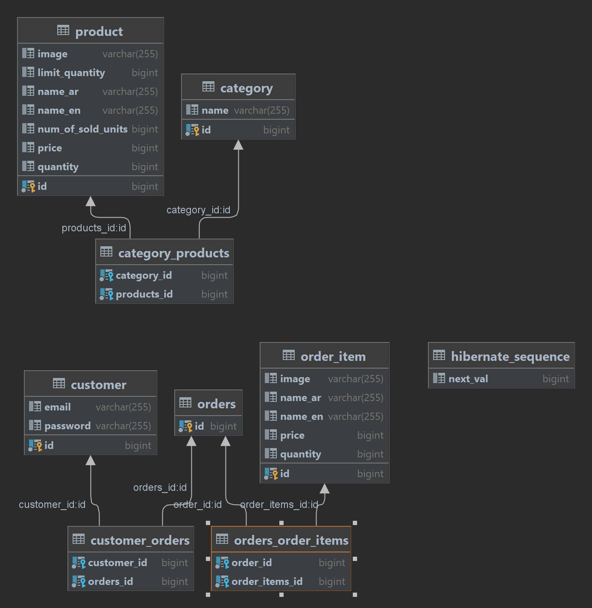
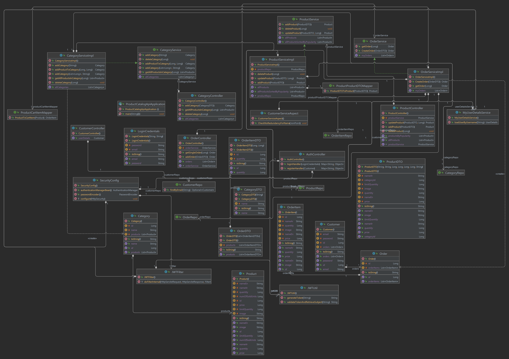

# Product_Catalog_API

API for E commerce app from Requirement document

[Requirement document](./requirements.md)


### post man for API end points map
[](https://app.getpostman.com/run-collection/30ef984c008334ca9696?action=collection%2Fimport)


### prepare local docker instance for mysql

```shell
 docker run --name mysql1 -p 3306:3306 -e MYSQL_ROOT_PASSWORD=root  mysql:latest
```

[//]: # ([How to create oracle docker image]&#40;https://github.com/oracle/docker-images/tree/main/OracleDatabase/SingleInstance&#41;)

[//]: # ()
[//]: # (```shell)

[//]: # ( docker run --name oracle19 )

[//]: # ( -p 1521:1521 -p 5500:5500 )

[//]: # ( -e ORACLE_PWD=system )

[//]: # ( -v E:/docker/oraclexedatabase:/opt/oracle/oradata )

[//]: # ( 6ca1a57e059ad388721234dbcacfcb2e1bd3c60c140ed2a24be32a9e99d1d504)

[//]: # (#last number is the image id )

[//]: # (```)
### database config 
modify the properties file

```properties
spring.datasource.username=root
spring.datasource.password=root
spring.datasource.url=jdbc:mysql://127.0.0.1:3306/product_catalog_api
```

[//]: # (```properties)

[//]: # (spring.datasource.url=jdbc:oracle:thin:@localhost:1521:xe)

[//]: # (spring.datasource.username=system)

[//]: # (spring.datasource.password=system)

[//]: # (```)
### project entity diagram


### database ERD



### run the project

- first install maven [steps](https://maven.apache.org/install.html)
- use this command to run spring project `mvn spring-boot:run`

### package this app

- clean create jar `mvn clean install`
- run this jar `java -jar <jar file name>`

### project class diagram




### database sql 

```sql
create table category
(
    id   bigint       not null
        primary key,
    name varchar(255) null
);

create table customer
(
    id       bigint       not null
        primary key,
    email    varchar(255) null,
    password varchar(255) null
);

create table hibernate_sequence
(
    next_val bigint null
);

create table order_item
(
    id       bigint       not null
        primary key,
    image    varchar(255) null,
    name_ar  varchar(255) null,
    name_en  varchar(255) null,
    price    bigint       null,
    quantity bigint       null
);

create table orders
(
    id bigint not null
        primary key
);

create table customer_orders
(
    customer_id bigint not null,
    orders_id   bigint not null,
    constraint UK_4m0sjmnfkb97mpn89e5xnw3v3
        unique (orders_id),
    constraint FK39sxykqbp8npv4p80lt3p23i8
        foreign key (orders_id) references orders (id),
    constraint FK7ntkighomv9fa5287rev8a3wy
        foreign key (customer_id) references customer (id)
);

create table orders_order_items
(
    order_id       bigint not null,
    order_items_id bigint not null,
    constraint UK_9d47gapmi35omtannusv6btu3
        unique (order_items_id),
    constraint FK3l8rktw0f4w5t6tift31e2d7c
        foreign key (order_id) references orders (id),
    constraint FK7nw03p9mxq154wvbsonaq0qrw
        foreign key (order_items_id) references order_item (id)
);

create table product
(
    id                bigint       not null
        primary key,
    image             varchar(255) null,
    limit_quantity    bigint       null,
    name_ar           varchar(255) null,
    name_en           varchar(255) null,
    num_of_sold_units bigint       null,
    price             bigint       null,
    quantity          bigint       null
);

create table category_products
(
    category_id bigint not null,
    products_id bigint not null,
    constraint UK_fdnk3mk70n1rc08vw1cj65kqw
        unique (products_id),
    constraint FKe9irm5a62pmolhvr468cip3v3
        foreign key (products_id) references product (id),
    constraint FKqwkr0l0xbluhhkm7s0c1tg8en
        foreign key (category_id) references category (id)
);


```